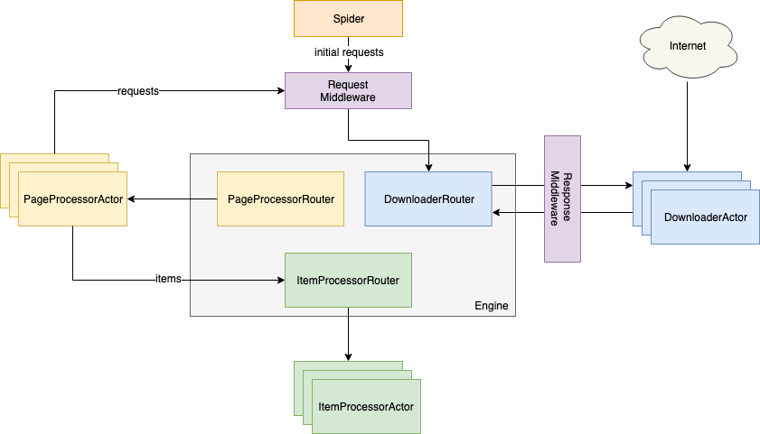

Scrawler
========

Scrawler is distributed crawler framework that based on Akka. Inspired by [scrapy](https://scrapy.org/).

# Architecture

# Components
* Scrawler Engine: The engine is responsible for controlling the data flow between all components of the system, and triggering events when certain actions occur.
* Downloader: The Downloader is responsible for fetching web pages and feeding them to the engine
* PageProcessor: Response will be converted to Page. You can extract requests and items from a Page.
* ItemProcessor: The ItemProcessor is responsible for processing the items once they have been extracted.
* Middleware: There are two kinds of middlewares: RequestMiddleare and ResponseMiddleware. You can implement them for pre processing requests and responses.

# Key Features
* Event-driven framework.
* Dynamic downloader and processor per workload.
